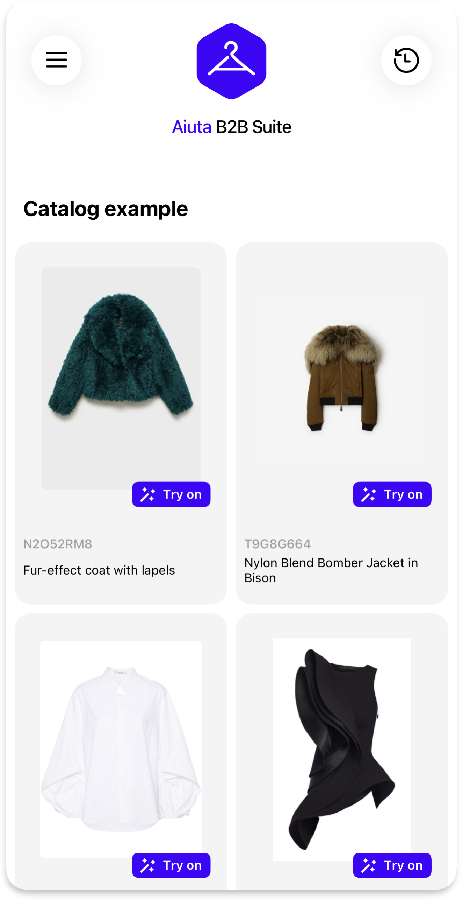

# Demo Applications

{width=200}

Experience Aiuta SDK in action through our demo applications. These applications showcase the full range of virtual try-on capabilities and customization options available in the SDK.

## Available Demo Apps

- :fontawesome-brands-app-store-ios: [Download on the __App Store__](https://apps.apple.com/app/id6477541220){:target="_blank"}
- :fontawesome-brands-google-play: [Get it on __Google Play__](https://play.google.com/store/apps/details?id=com.aiuta.fashionsdk.demo&hl=en){:target="_blank"}

## Using the Demo

1. Download the appropriate demo app for your platform [^1]
2. Request an access code [from Aiuta by email](mailto:Partnership@aiuta.com) if you don't have one yet
3. Launch the application and enter the code
4. Select an item from the sample catalog and tap "Try on" 
5. Experience the SDK and virtual try-on in action
6. Explore various SDK pages and features

## Features Available

The demo applications helps you to:

- Experience the complete virtual try-on flow
- Explore the user interface and navigation
- Test the performance and quality of virtual try-ons
- Test different UI customization options [^2]
- Experience the SDK's integration capabilities
- Demonstrate the technology to stakeholders
- Plan your implementation

[^1]: The iOS demo app uses unlisted distribution on the App Store, discoverable only with a direct link above.
[^2]: 
    The Android demo app currently has limited customization capabilities compared to the iOS version. For the most comprehensive demonstration of the SDK's customization features, we recommend trying the iOS demo app. However, please note that both Android and iOS SDKs provide **same customization and interaction capabilities** for your production applications.
