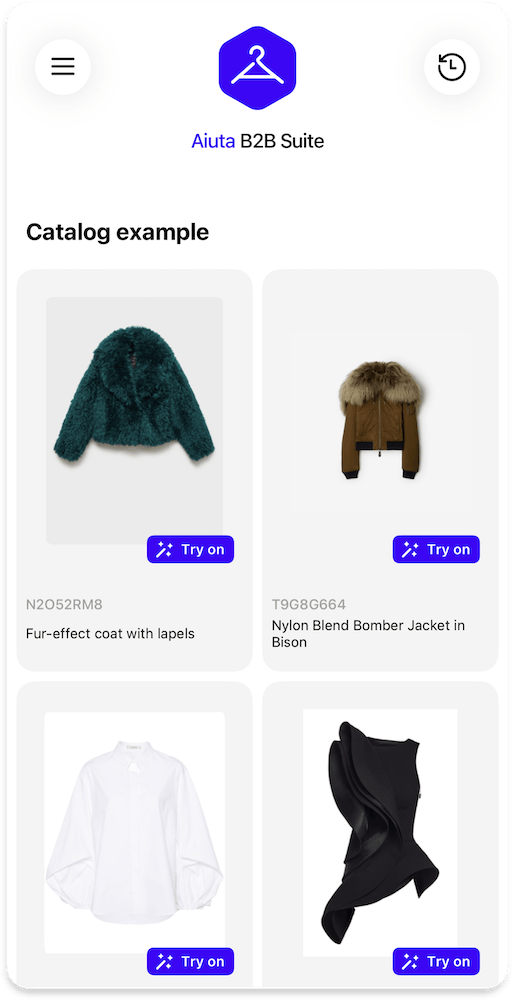

# Demo Applications

{width=200}

Experience Aiuta SDK in action through our demo applications. These applications showcase the full range of virtual try-on capabilities and customization options available in the SDK.

## Available Demo Apps

### iOS

[Download from App Store](https://apps.apple.com/app/id6477541220)

!!! warning "App Store Availability"
    The demo app is unlisted on the App Store. Please use the direct link above to access it.

### Android

[Download from Google Play](https://play.google.com/store/apps/details?id=com.aiuta.fashionsdk.demo&hl=en)

!!! note "Android Demo Limitations"
    The Android demo app currently has limited customization capabilities compared to the iOS version. For the most comprehensive demonstration of the SDK's customization features, we recommend trying the iOS demo app. However, please note that both Android and iOS SDKs provide **identical** customization and interaction capabilities for your production applications.

## Features Available in Demo

The demo applications allow you to:

- Experience the complete virtual try-on flow
- Test different UI customization options
- Try various garment types and styles
- Explore the user interface and navigation
- Test the performance and quality of virtual try-ons
- Experience the SDK's integration capabilities

## Using the Demo

1. Download the appropriate demo app for your platform
2. Request an access code from Aiuta by emailing [Partnership@aiuta.com](mailto:Partnership@aiuta.com) if you don't have one yet
3. Launch the application and enter the code
4. Select an item from the sample catalog and tap "Try on" to experience the SDK and virtual try-on in action
5. Explore various UI elements and interactions

The demo applications are perfect for:

- Evaluating the SDK's capabilities
- Testing performance on your device
- Understanding the user experience
- Planning your implementation
- Demonstrating the technology to stakeholders
