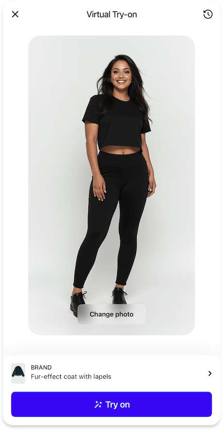

# Image Picker

{width=300}
{width=300}

The Image Picker feature in the main page allows users to select images for virtual try-on from various sources.

## When to Use

- Let users select photos from their device
- Allow users to take new photos with the camera
- Provide predefined model images for try-on
- Enable users to reuse previously uploaded images

## Sources

=== "Camera"

    ### Camera

    {width=300}

    Allows users to take new photos using their device's camera.

    ??? tip "Customization"

        #### Customization

        ##### [Icons](../resources/icons.md)
        - `camera24` - Icon for the camera button in the bottom sheet list

        ##### [Text Elements](../resources/localization.md)
        - `cameraButtonTakePhoto` - Label for the button used to take a photo
        - `cameraPermissionTitle` - Title for the camera permission alert
        - `cameraPermissionDescription` - Description for the camera permission alert
        - `cameraPermissionButtonOpenSettings` - Label for the button that opens app settings

=== "Gallery"

    ### Photo library

    {width=300}

    Enables users to select photos from their device's photo library.

    ??? tip "Customization"

        #### Customization

        ##### [Icons](../resources/icons.md)
        - `gallery24` - Icon for the gallery button in the bottom sheet list

        ##### [Text Elements](../resources/localization.md)
        - `galleryButtonSelectPhoto` - Label for the button used to select a photo

=== "Predefined Models"

    ### Predefined Models

    === "Enabled (default)"
        
        {width=300}
        {width=300}

        Provides a selection of predefined model images for virtual try-on.

        ??? tip "Customization"

            #### Customization

            ##### [Icons](../resources/icons.md)
            - `selectModels24` - Icon for the predefined models button

            ##### [Text Elements](../resources/localization.md)
            - `predefinedModelsTitle` - Title of the predefined models page and button
            - `predefinedModelsOr` - Label displayed before the predefined models button
            - `predefinedModelsEmptyListError` - Error message for empty model list
            - `predefinedModelsCategories` - Mapping of category IDs to titles (e.g., "man", "woman")

    === "Disabled"
        
        {width=300}

=== "Uploads History"

    ### Uploads History

    {width=300}
    {width=300}

    Allows users to access and reuse their previously used images. 
    The last image used will be preselected in the image picker for subsequent try-ons.

    ??? tip "Customization"

        #### Customization

        ##### [Text Elements](../resources/localization.md)
        - `uploadsHistoryButtonNewPhoto` - Text for the new photo button
        - `uploadsHistoryTitle` - Title for the uploads history screen
        - `uploadsHistoryButtonChangePhoto` - Text for the change photo button

        ##### [Styles](#)
        - `changePhotoButtonStyle` - Style for the "Change Photo" button:
            - `blurred` - Default blurred style with optional outline
            - `primary` - Solid button with primary background color

    #### Data Management

    === "Built-in"

        By default, the SDK uses platforms' local storage to store the history. This is the simplest approach and requires no additional configuration.

        !!! warning "Anonymous data"

            Neither the SDK nor the Aiuta API have any information about your users; all uploaded images are completely anonymous and are not linked to any user. Data in the history is stored locally on the device and may be lost when the app is reinstalled.

            If you need to link images to a user profile, use Data Provider instead.

    === "Data Provider"

        You can implement your own custom data provider that:

        - Provides the `uploadedImages` list of images previously used by the user
        - React to the `addUploadedImages` callback to store new images
        - React to the `deleteUploadedImages` callback to remove images by the user choise
        - React to the `selectUploadedImage` callback to reorder images when reused

        !!! info "This allows you to"
            - Integrate with your existing user management system
            - Sync the uploads history across devices
            - Implement custom business logic for history management
            - Control how images are stored and accessed

---

## [Analytics](../analytics/analytics.md)

The following analytics events are tracked during image selection:

| Type | Event | Page Id | Description |
|------|-------|---------|-------------|
| [`page`](../analytics/analytics.md#event-categories) | :material-minus: | [`imagePicker`](../analytics/analytics.md#page-identifiers) | Image picker page opened |
| [`picker`](../analytics/analytics.md#event-categories) | [`cameraOpened`](../analytics/analytics.md#picker-events) | [`imagePicker`](../analytics/analytics.md#page-identifiers) | Camera interface opened |
| [`picker`](../analytics/analytics.md#event-categories) | [`newPhotoTaken`](../analytics/analytics.md#picker-events) | [`imagePicker`](../analytics/analytics.md#page-identifiers) | New photo taken with camera |
| [`picker`](../analytics/analytics.md#event-categories) | [`photoGalleryOpened`](../analytics/analytics.md#picker-events) | [`imagePicker`](../analytics/analytics.md#page-identifiers) | Photo gallery opened |
| [`picker`](../analytics/analytics.md#event-categories) | [`galleryPhotoSelected`](../analytics/analytics.md#picker-events) | [`imagePicker`](../analytics/analytics.md#page-identifiers) | Photo selected from gallery |
| [`picker`](../analytics/analytics.md#event-categories) | [`uploadsHistoryOpened`](../analytics/analytics.md#picker-events) | [`imagePicker`](../analytics/analytics.md#page-identifiers) | Uploads history opened |
| [`picker`](../analytics/analytics.md#event-categories) | [`uploadedPhotoSelected`](../analytics/analytics.md#picker-events) | [`imagePicker`](../analytics/analytics.md#page-identifiers) | Previously used photo selected |
| [`picker`](../analytics/analytics.md#event-categories) | [`uploadedPhotoDeleted`](../analytics/analytics.md#picker-events) | [`imagePicker`](../analytics/analytics.md#page-identifiers) | Previously used photo deleted |
| [`picker`](../analytics/analytics.md#event-categories) | [`predefinedModelsOpened`](../analytics/analytics.md#picker-events) | [`imagePicker`](../analytics/analytics.md#page-identifiers) | Predefined models list opened |
| [`picker`](../analytics/analytics.md#event-categories) | [`predefinedModelSelected`](../analytics/analytics.md#picker-events) | [`imagePicker`](../analytics/analytics.md#page-identifiers) | Predefined model selected |
| [`exit`](../analytics/analytics.md#event-categories) | :material-minus: | [`imagePicker`](../analytics/analytics.md#page-identifiers) | SDK was closed on the image picker page |

---

## How to implement

- :fontawesome-brands-android: __Android__
- :fontawesome-brands-apple: __iOS__
- :fontawesome-brands-flutter: __Flutter__

