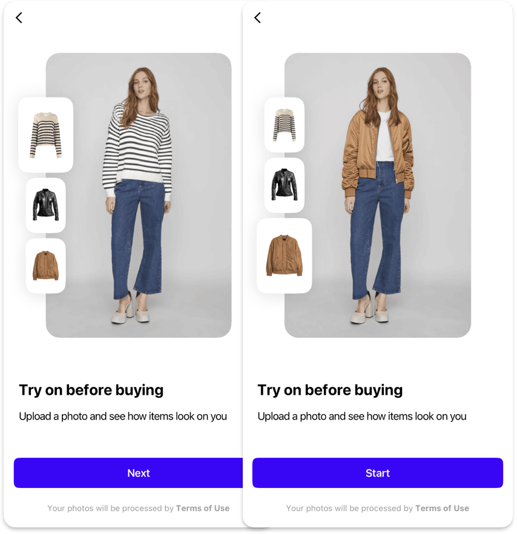

# Onboarding

The Onboarding feature guides users through the SDK's functionality, helping them understand how to use the virtual try-on experience effectively. It consists of two main pages: "How It Works" and "Best Results".

## When to Use

- Show onboarding when users first interact with the SDK
- Use it to explain the virtual try-on process
- Guide users on how to achieve the best results
- Help users understand the feature's capabilities

!!! info "Display management"
    The Onboarding is displayed only once when the user first opens the SDK.
    After completion, it won't be shown again unless the completion status is reset.

## Customization

#### [Text Elements](../resources/localization.md)
- `onboardingButtonNext` - Text for the "Next" button
- `onboardingButtonStart` - Text for the "Start" button

#### [Typography](../resources/typography.md)
- General `buttonM` text style for Next/Start button

#### [Shapes](../resources/shapes.md)
- General `buttonM` shape for Next/Start button

#### [Colors](../resources/colors.md)
- General `brand` color for button background
- General `onDark` color for button label

---

## How It Works

{ width=600 }

The "How It Works" page provides an interactive demonstration of the virtual try-on feature:

- Shows 3 example images of the same person in the same pose
- Each example includes both the person's photo and the item preview
- Demonstrates the transformation process

### Customization

#### [Images](../resources/images.md)
- `onboardingHowItWorksItems` - List of 3 items, each containing:
    - `itemPreview` - Flatlay image of the item for try-on with transparent background
    - `itemPhoto` - Example image of the try-on result with the person wearing this item

#### [Text Elements](../resources/localization.md)
- `onboardingHowItWorksPageTitle` - Optional title for the page
- `onboardingHowItWorksTitle` - Title displayed below the interactive section
- `onboardingHowItWorksDescription` - Description explaining how the try-on feature works

#### [Shapes](../resources/shapes.md)
- `onboardingImageL` - Shape for large image views
- `onboardingImageS` - Shape for small image views

---

## Best Results

The "Best Results" page helps users achieve optimal results:

- Shows 2 good examples and 2 bad examples of input images
- Provides guidance on photo requirements

!!! warning "Deprecated"
    It's recommended to disable the Best Results page since similar examples
    are included in the Image Picker feature.

### Customization

#### [Images](../resources/images.md)
- `onboardingBestResultsGood` - List of 2 images representing good examples
- `onboardingBestResultsBad` - List of 2 images representing bad examples

#### [Icons](../resources/icons.md)
- `onboardingBestResultsGood24` - Icon for good examples badge
- `onboardingBestResultsBad24` - Icon for bad examples badge

#### [Text Elements](../resources/localization.md)
- `onboardingBestResultsPageTitle` - Optional title for the page
- `onboardingBestResultsTitle` - Title displayed below the best results samples
- `onboardingBestResultsDescription` - Description explaining how to achieve the best results

#### [Shapes](../resources/shapes.md)
- `onboardingImageS` - Shape for example image views

---

## [Analytics](../analytics/analytics.md)

The following analytics events are tracked during onboarding:

| Type | Event | Page Id | Description |
|------|-------|---------|-------------|
| [`page`](../analytics/analytics.md#event-categories) | :material-minus: | [`howItWorks`](../analytics/analytics.md#page-identifiers) | How It Works page opened |
| [`page`](../analytics/analytics.md#event-categories) | :material-minus: | [`bestResults`](../analytics/analytics.md#page-identifiers) | Best Results Page opened |
| [`onboarding`](../analytics/analytics.md#event-categories) | [`onboardingFinished`](../analytics/analytics.md#onboarding-events) | :octicons-repo-forked-24:{ title="howItWorks, bestResults or consent"} | Completion of all onboarding steps |
| [`exit`](../analytics/analytics.md#event-categories) | :material-minus: | [`howItWorks`](../analytics/analytics.md#page-identifiers) | SDK was closed on the how it works screen |
| [`exit`](../analytics/analytics.md#event-categories) | :material-minus: | [`bestResults`](../analytics/analytics.md#page-identifiers) | SDK was closed on the best results screen |

## How to implement

- :fontawesome-brands-android: __Android__
- :fontawesome-brands-apple: __iOS__
- :fontawesome-brands-flutter: __Flutter__

