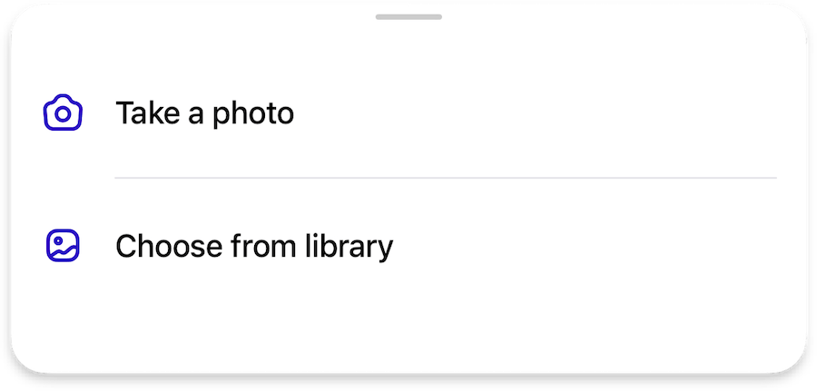

# Other styles, toggles and settings

This page contains descriptions of additional unclassified settings for various user interface components that provide more configuration flexibility.

## Page Bar

- A toggle to specify whether the close button should be positioned on the right side.

=== "Default"

    { width=450 }

=== "`preferCloseButtonOnTheRight`"

    { width=450 }    

## Bottom Sheet

- Adjusting delimiters in the bottom sheet icon buttons

=== "Default"

    { width=450 }

=== "`extendDelimitersToTheRight`"

    { width=450 }

=== "`extendDelimitersToTheLeftAndRight`"

    { width=450 }

<!-- ## Various pages    

- Optinal `reduceShadows` toggle to reduce shadows on the page where it is possible

- Special tool button / status style of:

    - Deafult `blurred` for a blur effect view with `primary` text color
    - Custom `blurredWithOutline` to add outline/border for a blur view
    - Custom `primary` for opaque view with `onDark` text color -->

