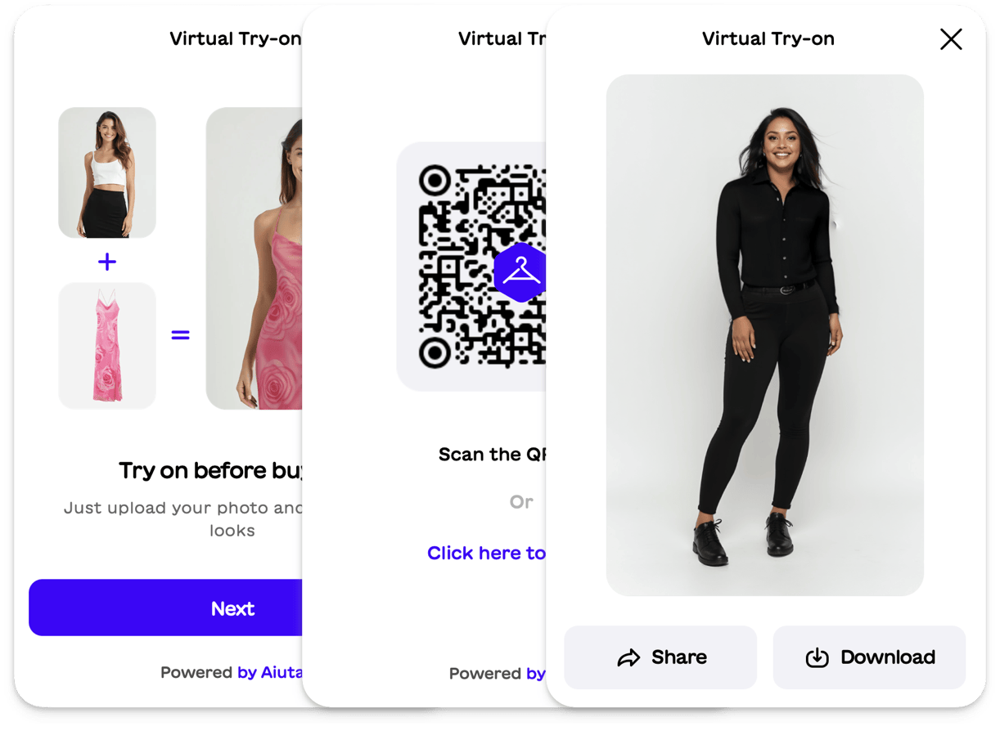

# Shopify App

{width=540}

Aiuta Try-On allows shoppers to see how clothes fit and look on them in real time, answering the key question: “Will this item suit me?”
## Links

- :fontawesome-brands-shopify: &nbsp; [View in the __Shopify__ app store](https://shopify.aiuta.com){:target="_blank"}
- :material-web: &nbsp; [Open demo store](https://aiuta-demo-store.myshopify.com){:target="_blank"}

- :material-book-open-variant: &nbsp; [Read the integration guide and review additional resources...](../shopify/overview.md)

## Benefits

 The app integrates seamlessly with your product pages, enhancing customer confidence and reducing returns. Perfect for brands of any size looking to drive engagement and conversions!

- Realistic & Quick Virtual Try-On solution
- Fit Optimization that adapts clothing visuals to different body types
- Seamless Integration in just 2 steps
