# User Interface Configuration Scheme

<div class="grid cards" markdown>
- :material-book-open-variant: &nbsp; ... part of [configuration page](configuration.md)
</div>

Configuration of the user interface presentation style, swipe-to-dismiss policy, and UI components themes for the Aiuta SDK.

### [:material-arrow-up-left:](configuration.md#configuration) User Interface
```typescript
UserInterface {
  presentationStyle: PresentationStyle // (1)!
  swipeToDismiss: SwipeToDismissPolicy // (2)!
  theme: Theme // (3)!
}

enum PresentationStyle {
  fullScreen // (4)!
  bottomSheet // (5)!
  pageSheet // (6)!
}

enum SwipeToDismissPolicy {
  allowAlways // (7)!
  allowHeaderSwipeOnly // (8)!
  protectTheNecessaryPages // (9)!
}
```

1.  !!! note "iOS and Flutter only"
        
        Specifies the manner in which the SDK's UI overlays the application's existing UI. This setting determines the visual presentation style, such as whether the SDK UI appears as a full-screen overlay, or covers the application with a bottom sheet.

2.  !!! note "iOS only"
        
        This property specifies the policy for dismissing the SDK's user interface through a swipe gesture. It determines how and when the swipe-to-dismiss action can be performed by the user. The policy can vary, allowing for different levels of interaction, such as always allowing a swipe to dismiss, restricting it to certain conditions, or permitting it only when swiping from specific areas of the interface.

3.  [:material-arrow-down-left:](#theme) Specifies the theme configuration settings that determine the appearance and style of the UI components within the SDK. This includes defining color schemes, typography, and other visual elements to ensure a cohesive and customizable user interface experience.

4.  Presents the SDK in full-screen mode. This style occupies the entire screen, hiding the parent view completely.

5.  Opens the SDK in a bottom sheet. 

    !!! note "Partial iOS support"
        This mode is supported on iOS from version `16` onwards. For older versions, it defaults to `pageSheet`. Unlike `pageSheet`, the parent view remains fullscreen but is covered by the sheet, rather than being stacked behind it.

6.  The SDK appears in a page sheet, which partially covers the parent view, allowing users to see some of the underlying content while interacting with the SDK. Unlike a `bottomSheet`, which keeps parent view fullscreen, a page sheet stacking the parent view behind, slightly shrinking and moving it away from the screen edges.

    !!! tip ""
        - This mode is recommended starting from __iOS__ 13. For more information, refer to [Best practices from Apple's HIG :octicons-link-external-24:](https://developer.apple.com/design/human-interface-guidelines/sheets#Best-practices){:target="_blank"}.
        - On __Android__, this mode behaves as a `bottomSheet`.

7.  Allows the SDK to be dismissed at any time by swiping down anywhere on the screen.
    
    !!! tip ""
        This policy provides the most flexibility for users, enabling them to close the SDK from any page or context.    

8.  Restricts dismissal to swiping down on the header area only.
    
    !!! tip ""
        This policy limits the swipe-to-dismiss gesture to the header area, reducing the likelihood of accidental dismissals.

9.  Applies different swipe-to-dismiss policies based on the page context.
    
    !!! tip ""
        
        - On pages that are safe to close, such as onboarding or photo picker pages, the `allowAlways` policy is applied, allowing dismissal from anywhere on the screen.
        - On critical pages, such as those waiting for generation or displaying results, the `allowHeaderSwipeOnly` policy is applied to prevent accidental dismissals.
    
    This policy provides a balance between user convenience and protecting critical workflows, ensuring that users can dismiss the SDK when appropriate while safeguarding important pages.    


#### [:material-arrow-up-left:](#user-interface) Theme
```typescript
Theme {
  color: ColorTheme // (1)!
  label: LabelTheme // (2)!
  image: ImageTheme // (3)!
  button: ButtonTheme // (4)!
  pageBar: PageBarTheme // (5)!
  bottomSheet: BottomSheetTheme // (6)!
  activityIndicator: ActivityIndicatorTheme // (11)!
  selectionSnackbar: SelectionSnackbarTheme // (7)!
  errorSnackbar: ErrorSnackbarTheme // (8)!
  productBar: ProductBarTheme // (9)!
  powerBar: PowerBarTheme // (10)!
}
```

1. [:material-arrow-down-left:](#color) Defines the color scheme, brand colors, and various color states for UI elements.

    { width=400 }

2. [:material-arrow-down-left:](#label) Typography and text styling for different label types across the interface.

    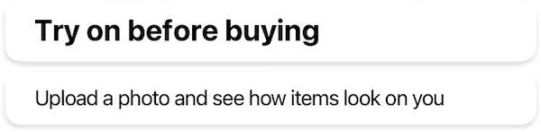{ width=400 }

3. [:material-arrow-down-left:](#image) Shapes, sizes, and error state icon for image views.

    { width=400 }

4. [:material-arrow-down-left:](#button) Buttons styles, including typography and shape configurations for different button sizes.

    { width=172 } 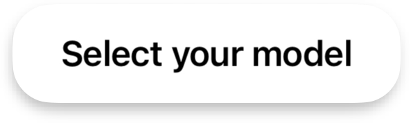{ width=200 }

5. [:material-arrow-down-left:](#page-bar) Navigation bar appearance, including title styling and navigation button icons.

    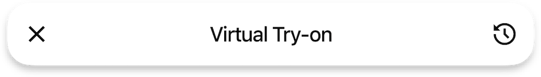{ width=400 }

6. [:material-arrow-down-left:](#bottom-sheet) Bottom sheet presentation, including grabber appearance and sheet shape for both main SDK and internal sheets.

    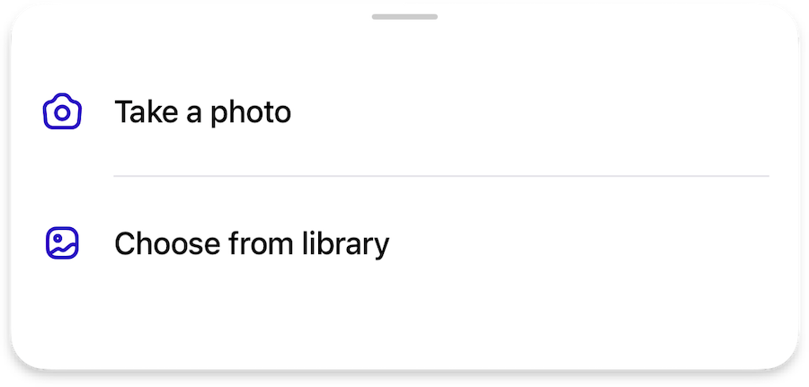{ width=400 }

7. [:material-arrow-down-left:](#selection) Multi-selection interface for list views, including selection controls and action buttons.

    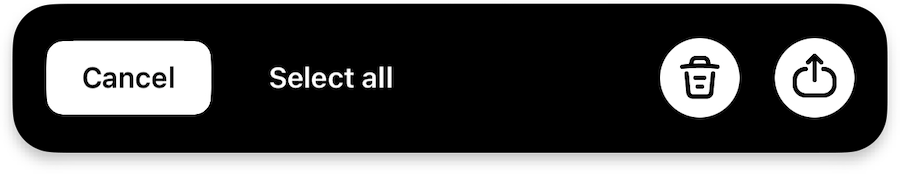{ width=400 }

8. [:material-arrow-down-left:](#error) Error message presentation, including error icons and retry button styling.

    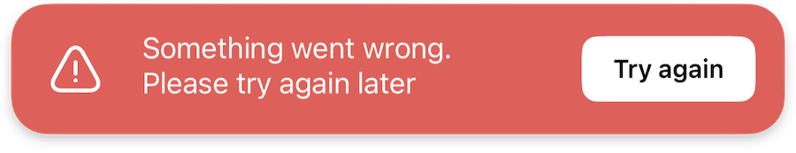{ width=400 }

9. [:material-arrow-down-left:](#product) Product information display, including typography for product details and optional price styling.
 
    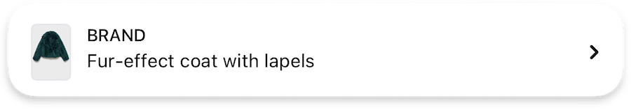{ width=400 }

10. [:material-arrow-down-left:](#powered-by) "Powered By Aiuta" branding element appearance.

    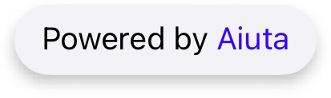{ width=150 }

11. [:material-arrow-down-left:](#activity-indicator) Appearance and customization of loading indicators.

    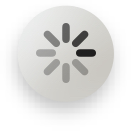{ width=36}


###### [:material-arrow-up-left:](#theme) Color
```typescript
ColorTheme {
  scheme: ColorScheme // (1)!
  brand: Color // (2)!
  primary: Color // (3)!
  secondary: Color // (4)!
  onDark: Color // (5)!
  onLight: Color // (6)!
  background: Color // (7)!
  screen: Color // (8)!
  neutral: Color // (9)!
  border: Color // (10)!
  outline: Color // (11)!
}

enum ColorScheme {
  light // (12)!
  dark // (13)!
}
```

1.  Defines whether the SDK uses a light or dark theme.
    Provided colors should match the scheme.

    !!! note ""
        Affects the style of blur components

    !!! note ""
        On __`iOS only`__ it affects the appearance of system screens (e.g., photo gallery, share activity, etc.) and ensures that their `UIUserInterfaceStyle` matches the selected style. For example, if the SDK is set to a light theme but the system theme on the device is dark, the system windows invoked by the SDK will still use the light theme.

2. Main accent color for primary actions and highlights throughout the interface.

    { width=400 }

    !!! example ""
        Default ARGB :material-square-rounded:{ .cl-brand } `#FF4000FF`

3. Primary color used for main content labels and icons, and important information.

    { width=300 }

    !!! example ""
        Default ARGB :material-square-rounded:{ .cl-primary } `#FF000000`


4. Secondary color used for supporting content and less prominent information.

    { width=300 }

    !!! example ""
        Default ARGB :material-square-rounded:{ .cl-secondary } `#FF9F9F9F`

5. Preferably light color __in any scheme__ optimized for use on dark, brand, and neutral backgrounds.

    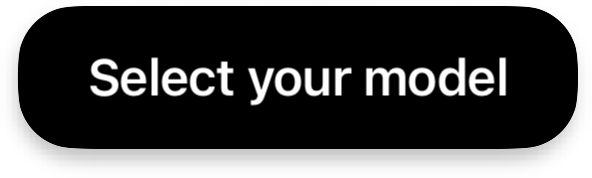{ width=200 }

    !!! example ""
        Default ARGB :material-square-rounded:{ .cl-on-dark } `#FFFFFFFF`

6. Preferably dark color __in any scheme__ optimized for use on light backgrounds.

    { width=200 }

    !!! example ""
        Default ARGB :material-square-rounded:{ .cl-on-light } `#FF000000`

7. Main background color used throughout the SDK interface.

    !!! example ""
        Default ARGB :material-square-rounded:{ .cl-background } `#FFFFFFFF`

8.  Zero-elevation background color.

    For the full-screen mode in the `dark` scheme, this color is used as a page background color, while bottom sheets inside the SDK will still use the `background` color. In any scheme, it will be used for full-screen image galleries.

    !!! note ""
        It's actually supposed to be black or close to black in any scheme.

    !!! example ""
        Default ARGB :material-square-rounded:{ .cl-screen } `#FF000000`

9. Neutral background color used for various UI components.

    !!! example ""
        Default ARGB :material-square-rounded:{ .cl-neutral } `#FFF2F2F7`

10. Color used for component borders and dividers.

    !!! example ""
        Default ARGB :material-square-rounded:{ .cl-border } `#FFE5E5EA`

11. Color used for blur outlines and checkmark borders.

    !!! example ""
        Default ARGB :material-square-rounded:{ .cl-outline } `#FFC7C7CC`

12. Light theme with predominantly light colors in the design.

13. Dark theme with predominantly dark colors in the design.


###### [:material-arrow-up-left:](#theme) Label
```typescript
LabelTheme {
  typography: {
    titleL: TextStyle // (1)!
    titleM: TextStyle // (2)!
    regular: TextStyle // (3)!
    subtle: TextStyle // (4)!
  }
}
```

1. Defines the text style for large titles, typically used for main headings and prominent text elements.
2. Specifies the text style for medium titles, commonly used for section headers and secondary headings.
3. Sets the text style for regular body text and standard content throughout the interface.
4. Determines the text style for subtle or less prominent text, often used for secondary information and supporting content.


###### [:material-arrow-up-left:](#theme) Image
```typescript
ImageTheme {
  shapes: {
    imageL: Shape // (1)!
    imageS: Shape // (2)!
  },
  icons: {
    imageError36: Icon // (3)!
  }
}

```

1. Defines the shape configuration for large image views, allowing customization of the visual appearance for prominent images.
2. Specifies the shape configuration for small image views, enabling consistent styling for secondary or thumbnail images.
3. Sets the icon to be displayed when an image fails to load, providing visual feedback for error states.


###### [:material-arrow-up-left:](#theme) Button
```typescript
ButtonTheme {
  typography: {
    buttonM: TextStyle // (1)!
    buttonS: TextStyle // (2)!
  },
  shapes: {
    buttonM: Shape // (3)!
    buttonS: Shape // (4)!
  }
}

```

1. Defines the text style for a regular medium-sized buttons.
2. Specifies the text style for small buttons.
3. Sets the shape configuration for medium buttons.
4. Configures the shape for small buttons.


###### [:material-arrow-up-left:](#theme) Page Bar
```typescript
PageBarTheme {
  typography: {
    pageTitle: TextStyle // (1)!
  },
  icons: {
    back24: Icon // (2)!
    close24: Icon // (3)!
  },
  settings: {
    preferCloseButtonOnTheRight: Bool // (4)!
  }
}

```

1. Defines the text style for page titles in the navigation bar, controlling the appearance of header text.
2. Specifies the icon used for the back navigation button.
3. Sets the icon for the close button.
4.  Controls the position of the close button, determining whether it appears on the right side of the navigation bar.

    !!! example ""

        === "Default &nbsp; `false`"

            { width=450 }

        === "`true`"

            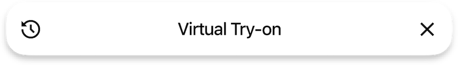{ width=450 }   


###### [:material-arrow-up-left:](#theme) Bottom Sheet
```typescript
BottomSheetTheme {
  typography: {
    iconButton: TextStyle // (1)!
    chipsButton: TextStyle // (2)!
  },
  shapes: {
    bottomSheet: Shape // (3)!
    chipsButton: Shape // (4)!
  },
  grabber: {
    width: Number // (5)!
    height: Number // (6)!
    topPadding: Number // (7)!
  },
  settings: {
    extendDelimitersToTheRight: Bool // (8)!
    extendDelimitersToTheLeft: Bool // (9)!
  }
}

```

1. Defines the text style for icon buttons within the bottom sheet.
2. Specifies the text style for chips-style buttons in the bottom sheet interface.
3. Sets the shape configuration for the bottom sheet container, controlling its visual appearance.
4. Configures the shape for chips-style buttons, determining their visual style.
5. Controls the width of the grabber handle used for dragging the bottom sheet.
6. Determines the height of the grabber handle for bottom sheet interaction.
7. Sets the vertical padding between the grabber and the top of the bottom sheet.
8. Controls whether the bottom sheet delimiters extend to the right edge.
9. Determines whether the bottom sheet delimiters extend to the left edge.


###### [:material-arrow-up-left:](#theme) Activity Indicator
```typescript
ActivityIndicatorTheme {
  icons: {
    loading14: Icon | null // (1)!
  },
  colors: {
    overlay: Color // (4)!
  }
  settings: {
    indicationDelay: Number // (2)!
    spinDuration: Number // (3)!
  }
}

```

1. Optional icon for the activity indicator. If not provided, the system's default indicator will be used.

    !!! example ""
        <sub>{ width=30}</sub> <sup>System activity indicator by default</sup>

2. The time in milliseconds before the activity indicator appears. If the task completes before this delay, the indicator will not be shown. Otherwise, the indicator will appear.

3. The duration in milliseconds for one complete rotation of the activity indicator. This setting controls how fast the indicator spins, providing a visual cue of activity progress.
    
    !!! note ""
        The spin duration only applies when a custom icon is used for the activity indicator. If the system's default indicator is used, this setting will be ignored and the indicator will spin with the system default speed.

4. Overlay color used to cover any view when it needs to be locked for an activity. The activity indicator will be placed at the center of this overlay.


###### [:material-arrow-up-left:](#theme) Selection
```typescript
SelectionSnackbarTheme {
  strings: {
    select: String // (1)!
    cancel: String // (2)!
    selectAll: String // (3)!
    unselectAll: String // (4)!
  },
  icons: {
    trash24: Icon // (5)!
    check20: Icon // (6)!
  },
  colors: {
    selectionBackground: Color // (7)!
  }
}

```

1. Defines the text label for the select action button in the selection interface.
2. Specifies the text label for the cancel action button to dismiss the selection mode.
3. Sets the text label for the select all action to choose all available items.
4. Configures the text label for the unselect all action to deselect all chosen items.
5. Specifies the icon used for the delete action in the selection interface.
6. Sets the icon displayed to indicate selected items in the interface.
7. Controls the background color of the selection snackbar component.


###### [:material-arrow-up-left:](#theme) Error
```typescript
ErrorSnackbarTheme {
  strings: {
    defaultErrorMessage: String // (1)!
    tryAgainButton: String // (2)!
  },
  icons: {
    error36: Icon // (3)!
  },
  colors: {
    errorBackground: Color // (4)!
    errorPrimary: Color // (5)!
  }
}

```

1. Defines the default text message displayed when an error occurs in the interface.
2. Specifies the text label for the retry action button in the error snackbar.
3. Sets the icon displayed to indicate the error state in the snackbar.
4. Controls the background color of the error snackbar component.
5. Defines the primary color used for error-related elements in the snackbar.


###### [:material-arrow-up-left:](#theme) Product
```typescript
ProductBarTheme {
  prices: ProductBarPricesTheme | null // (1)!
  typography: {
    product: TextStyle // (2)!
    brand: TextStyle // (3)!
  },
  icons: {
    arrow16: Icon // (4)!
  },
  settings: {
    applyProductFirstImageExtraPadding: Bool // (5)!
  }
}

ProductBarPricesTheme {
  typography: {
    price: TextStyle // (6)!
  },
  colors: {
    discountedPrice: Color // (7)!
  }
}
```

1. Configures the price display settings for the product bar, including typography and colors for price elements.
2. Defines the text style for product names in the product bar.
3. Specifies the text style for brand names displayed in the product bar.
4. Sets the icon used to indicate expandable product details in the compact view.
5. Controls whether additional padding is applied to the first product image in the list.
6. Configures the text style specifically for price displays in the product bar.
7. Defines the color used to highlight discounted prices in the product bar.


###### [:material-arrow-up-left:](#theme) Powered By
```typescript
PowerBarTheme {
  strings: {
    poweredByAiuta: String // (1)!
  },
  colors: {
    aiuta: PowerBarColorScheme // (2)!
  }
}

enum PowerBarColorScheme {
  standard // (3)!
  primary // (4)!
}
```

1. Defines the text label for the "Powered By Aiuta" branding element in the interface.
2. Controls the color scheme used to highlight "Aiuta" in the `poweredByAiuta` label.
3. Uses the default Aiuta-brand color to highlight "Aiuta" in the `poweredByAiuta` label, which is :material-square-rounded:{ .cl-aiuta } `#FF4000FF`
4. Applies the [`primary` color](#color) to the entire label without highlighting "Aiuta".
