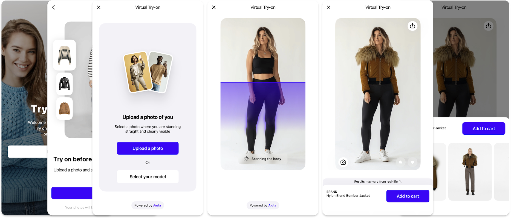

---
hide:
  - navigation
  - toc
---

# Aiuta Virtual Try-On Solutions



Let your customers visualize how clothes look on them — instantly and accurately

- High quality visualisation
- __7x faster__ than the average competitor
- Preserve pose and body shape

## Aiuta SDK Benefits

- **Simple integration** into your existing application with default settings
- Flexible **UI customization** to match your brand
- **Rich set of features** for creating a unique user experience
- **Full control** over user data and settings
- Detailed usage **analytics** on every SDK page and feature
- Ready-made solutions for interacting with your application

<div class="grid cards" markdown>

- :material-book-open-variant:{ .lg } &nbsp; [Explore Demo apps, SDK pages, customizations, integrations, analytcs and more...](about/demo-apps.md)

</div>

## Alternative – Direct API

If you prefer even more control over the implementation or have specific requirements, you can use the Aiuta API directly.<br>This approach gives you complete flexibility in building your custom virtual try-on solution.

<div class="grid cards" markdown>

- :material-book-open-variant:{ .lg } &nbsp; For detailed API documentation and integration guides, visit our [API Portal :octicons-link-external-24:](https://developer.aiuta.com/products/digital-try-on/documentation){:target="_blank"}.

</div>

!!! note ""
    Aiuta SDK is built on top of the same API, providing a pre-built UI layer and additional convenience features while maintaining the same core functionality.

## Platform Availability

<div class="grid cards" markdown>

-   :fontawesome-brands-android:{ .lg } &nbsp; __Android__

    ---

    ```
    minSdkVersion: 23
    targetSdkVersion: 35
    com.android.application: 8.6.0
    ndkVersion: 26.1.10909125
    ```

    [:octicons-arrow-right-24: Overview](android/overview.md)

-   :fontawesome-brands-apple:{ .lg } &nbsp; __iOS__

    ---

    ```
    iOS: 13+
    swift: 5.10
    Xcode: 15.3+
    ```
    
    [:octicons-arrow-right-24: Overview](ios/overview.md)

-   :fontawesome-brands-flutter:{ .lg } &nbsp; __Flutter__

    ---

    ```
    sdk: >=3.1.0 <4.0.0
    flutter: >= 3.19.6
    ```
    <sup class="cl-secondary">:fontawesome-brands-android:&nbsp; Android &nbsp; :fontawesome-brands-apple: iOS</sup>
    
    [:octicons-arrow-right-24: Overview](flutter/overview.md)  

-   :fontawesome-brands-js:{ .lg } &nbsp; __Web__ 

    ---

    Coming soon

-   :fontawesome-brands-shopify:{ .lg } &nbsp; __Shopify__ 

    ---

    [:octicons-arrow-right-24: Overview](shopify/overview.md)  

</div>
