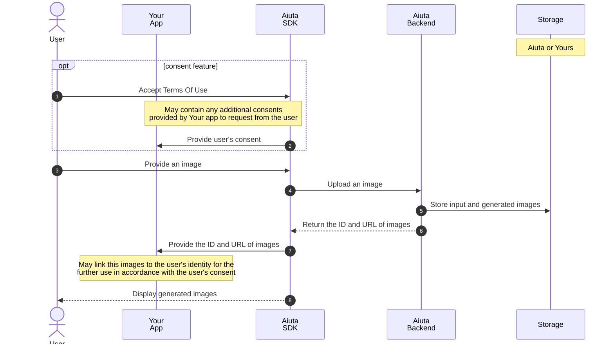
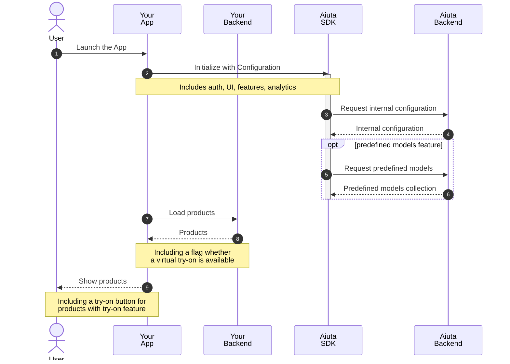

---
hide:
  - toc
---
# Diagrams

This page provides sequence diagrams illustrating the interactions between user, your application and Aiuta. The diagrams help visualize the flow of operations, such as initialization and the try-on process, highlighting the roles of the user, your app, backend services, Aiuta SDK and API.

## User data flow

Overview sequence diagram covers the handling of user photos. It shows the process from obtaining user consent to uploading and displaying images. 

!!! info "Anonymous photos" 
    We do not process any personal data other than these images, and all uploaded images remain anonymous to us. We also do not request your user IDs.



## Complete interaction sequences

The detailed sequence diagrams below cover all stages of interaction with the Aiuta SDK.

### Initialization

The next diagram illustrates the initialization process from launching the app to displaying products, including configuration and model requests.



!!! doc "Find more about Aiuta [Configuration](/sdk/about/developer/configuration/) for step 2"

!!! note "Feature availabilty"
    Please note in steps 8 and 9 that you should obtain information about the availability of the virtual try-on feature for each of your products from __your__ backend

### Try-On

=== "Default configuration"
    
    !!! note ""
        :octicons-dot-16: BuiltIn data providers :octicons-dot-16: Default features set :octicons-dot-16: Embedded legal info
    
    ``` mermaid
    sequenceDiagram
        autonumber
        actor USR as ⠀<br>User
        participant APP as Your<br>App
        participant BE as Your<br>Backend
        participant SDK as Aiuta<br>SDK
        participant API as Aiuta<br>Backend
        participant GS as Storage

        USR->>APP: Tap Try-on Button
        APP->>SDK: Call `startTryon`(Product)
        activate SDK
        SDK-->>USR: Presents SDK UI

        %% User Photo
        USR->>SDK: Select a photo
        SDK->>API: Upload a photo
        API->>GS: Save a photo to the storage
        Note over API,GS: Anonymous<br>the photo is associated with the<br>app entry, not the user entry
        API->>API: Generate photo ID, create URL
        Note over API: URL may contains access token
        
        deactivate SDK
    ```


!!! doc "Find more about"
    
    - Aiuta [Configuration](/sdk/about/developer/configuration/) 
    - [Common Models](/sdk/about/developer/common-models/)
