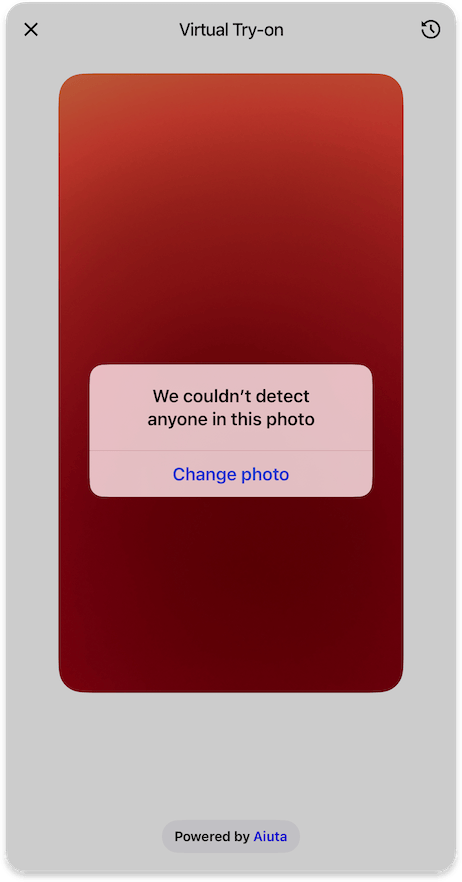

# Loading Screen

{width=300}

The Loading Screen is displayed during the virtual try-on process to keep users informed about the current status of their request. It shows different status messages as the system processes the image and generates the try-on result:

1. **Uploading Image** - When the user's photo is being uploaded
2. **Scanning Body** - While the system analyzes the body in the image
3. **Generating Outfit** - During the final try-on generation

---

??? tip "Customization"

    ## Customization

    ##### [Text Elements](../resources/localization.md)
    - Text for `tryOnLoadingStatusUploadingImage` state
    - Text for `tryOnLoadingStatusScanningBody` state
    - Text for `tryOnLoadingStatusGeneratingOutfit` state

    ##### [Icons](../resources/icons.md)
    - Optional `loading14` icon for the loading status

    !!! info "If no custom icon is provided"
        SDK will draw system default activity indicator

    ##### [Styles](#)
    - `backgroundGradient` for the loading animation
    - `statusStyle` appearance:
        - `blurred` - Default blurred style with optional outline
        - `primary` - Solid button with primary background color

---

## Error handling

=== "Invalid input image"

    ### Invalid Input Image

    {width=300}

    When the system detects that the uploaded image doesn't meet the requirements for virtual try-on (e.g., no person detected), it displays an error message with an option to try again with a different photo.

    ??? tip "Customization"

        #### Customization

        ##### [Text Elements](../resources/localization.md)
        - `invalidInputImageDescription` message for the alert
        - Label for the `invalidInputImageChangePhotoButton`

=== "Other errors"

    ### Other Errors

    {width=300}

    When other errors occur during the try-on process (such as network issues or server errors), the SDK displays an error snackbar with a message and retry option.

    ??? tip "Customization"

        #### Customization

        ##### [Text Elements](../resources/localization.md)
        - `defaultErrorMessage` displayed in the snackbar
        - Label for the `tryAgainButton`

        ##### [Icons](../resources/icons.md)
        - `error36` icon in the snackbar

        ##### [Colors](#)
        - `errorBackground` color for the snackbar
        - `errorPrimary` color for text and interactive elements

---

## [Analytics](../analytics/analytics.md)

The following analytics events may be tracked during the loading process:

| Type | Event | Page Id | Description |
|------|-------|---------|-------------|
| [`page`](../analytics/analytics.md#event-categories) | :material-minus: | [`loading`](../analytics/analytics.md#page-identifiers) | Loading screen opened |
| [`tryOn`](../analytics/analytics.md#event-categories) | [`photoUploaded`](../analytics/analytics.md#try-on-events) | [`loading`](../analytics/analytics.md#page-identifiers) | Successful upload of a selected or  captured photo for processing |
| [`tryOn`](../analytics/analytics.md#event-categories) | [`tryOnStarted`](../analytics/analytics.md#try-on-events) | [`loading`](../analytics/analytics.md#page-identifiers) | Initiation of the virtual try-on process with the selected image |
| [`tryOn`](../analytics/analytics.md#event-categories) | [`tryOnFinished`](../analytics/analytics.md#try-on-events) | [`loading`](../analytics/analytics.md#page-identifiers) | Successful completion of the virtual try-on process with generated results |
| [`tryOn`](../analytics/analytics.md#event-categories) | [`tryOnAborted`](../analytics/analytics.md#try-on-events) | [`loading`](../analytics/analytics.md#page-identifiers) | Try-on process was aborted by the Aiuta backend due to an invalid input image |
| [`tryOn`](../analytics/analytics.md#event-categories) | [`tryOnError`](../analytics/analytics.md#try-on-events) | [`loading`](../analytics/analytics.md#page-identifiers) | Occurrence of an error during the try-on process |
| [`exit`](../analytics/analytics.md#event-categories) | :material-minus: | [`loading`](../analytics/analytics.md#page-identifiers) | SDK was closed on the loading screen |

---

## How to implement

- :fontawesome-brands-android: __Android__
- :fontawesome-brands-apple: __iOS__
- :fontawesome-brands-flutter: __Flutter__

