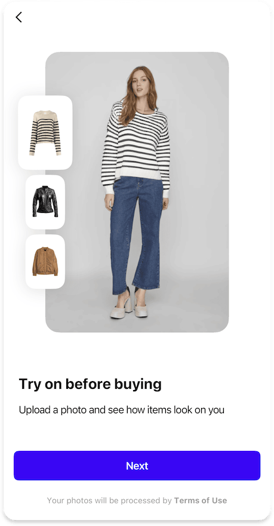
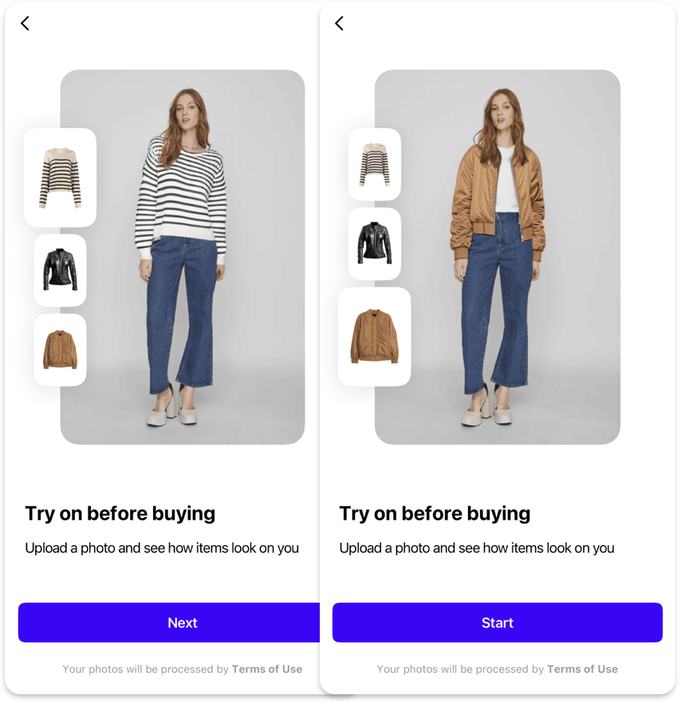
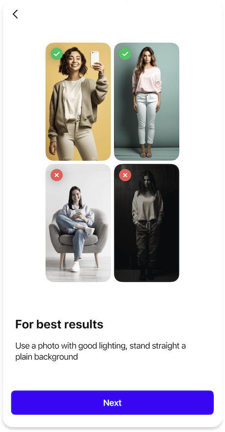
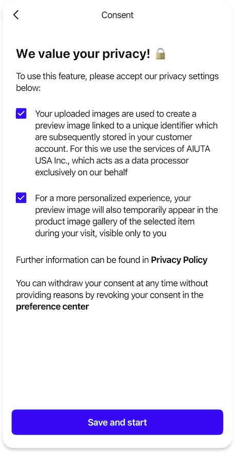

# Onboarding

{ width=300 }

The Onboarding feature guides users through the SDK's functionality, helping them understand how to use the virtual try-on experience effectively.

## When to Use

- Show onboarding when users first interact with the SDK
- Use it to explain the virtual try-on process

!!! info "Behavior"
    The Onboarding is displayed repeatedly until the user completes it. 
    After completion, it won't be shown again unless the completion status reset.

## Data Management

The SDK provides two options for managing the onboarding completion status:

=== "Built-in"

    By default, the SDK uses platforms' local storage to store the onboarding completion status. This is the simplest approach and requires no additional configuration.

=== "Data Provider"

    You can implement your own custom data provider that:

    - Provides the `isOnboardingCompleted` status whether the user has completed the onboarding process
    - React to the `completeOnboarding` callback to mark the onboarding as completed

    !!! info "This allows you to"
        - Integrate with your existing user management system
        - Sync the status across devices
        - Reset `isOnboardingCompleted` whenever you want to show the onboarding again

    !!! question ""
        See the [How to implement](#how-to-implement) section at the bottom for information on the relevant platform.

---

??? tip "Customization"

    ## Customization

    ##### [Text Elements](../resources/localization.md)
    - Text for the `onboardingButtonNext`
    - Text for the `onboardingButtonStart`

    ##### [Typography](../resources/typography.md)
    - General `buttonM` text style for Next/Start button

    ##### [Shapes](../resources/shapes.md)
    - General `buttonM` shape for Next/Start button

    ##### [Colors](../resources/colors.md)
    - General `brand` color for Next/Start button background
    - General `onDark` color for button label
    
    ##### [Styles](../resources/other.md)
    - Toogle `preferCloseButtonOnTheRight` to reverse pageBar

---

## Slides

=== "How It Works (Interactive)"

    ### How It Works

    { width=558 }

    The "How It Works" page provides an interactive demonstration of the virtual try-on feature:

    - Shows 3 example images of the same person in the same pose
    - Each example includes both the person's photo and the item preview
    - Demonstrates the transformation process

    !!! info "Default"
        By default, this is the only slide of the onboarding with embedded [terms of service](consent.md) instead of a separate consent
    
    ---

    ??? tip "Customization"

        #### Customization

        ##### [Images](../resources/images.md)
        - List of 3 `onboardingHowItWorksItems`, each containing:
            - Flatlay `itemPreview` image of the item for try-on with transparent background
            - Example `itemPhoto` image of the try-on result with the person wearing this item

        ##### [Text Elements](../resources/localization.md)
        - Optional `onboardingHowItWorksPageTitle`
        - `onboardingHowItWorksTitle` displayed below the interactive section
        - `onboardingHowItWorksDescription` explaining how the try-on feature works

        ##### [Typography](../resources/typography.md)
        - General `titleL` text style for the title
        - General `regular` text style for the description text

        ##### [Colors](../resources/colors.md)
        - General `primary` color for title and description

        ##### [Shapes](../resources/shapes.md)
        - `onboardingImageL` shape for large image views
        - `onboardingImageS` shape for small image views

=== "Best Results (Deprecated)"

    ### Best Results

    { width=300 }

    The "Best Results" page helps users achieve optimal results:

    - Shows 2 good examples and 2 bad examples of input images
    - Provides guidance on photo requirements

    !!! question "Why is it deprecated?"
        Examples of good source photos are now included into the Image Picker, so we recommend disabling this slide to avoid overwhelming the user with onboarding

    ---

    ??? tip "Customization"
        #### Customization

        ##### [Images](../resources/images.md)
        - List of 2 `onboardingBestResultsGood` images representing good examples
        - List of 2 `onboardingBestResultsBad`images representing bad examples

        ##### [Icons](../resources/icons.md)
        - `onboardingBestResultsGood24` icon for good examples badge
        - `onboardingBestResultsBad24` icon for bad examples badge

        ##### [Text Elements](../resources/localization.md)
        - Optional `onboardingBestResultsPageTitle`
        - `onboardingBestResultsTitle` displayed below the best results samples
        - `onboardingBestResultsDescription` explaining how to achieve the best results

        ##### [Typography](../resources/typography.md)
        - General `titleL` text style for the title
        - General `regular` text style for the description text

        ##### [Colors](../resources/colors.md)
        - General `primary` color for title and description

        ##### [Shapes](../resources/shapes.md)
        - `onboardingImageS` shape for example image views

        ##### [Styles](../resources/other.md)
        - Toggle to `reduceOnboardingBestResultsShadows` on the page

=== "Consent (Optional)"

    ### Consent

    { width=300 }

    The Consent page can be integrated into the onboarding flow as a slide to collect user permissions for data processing. This slide explains the terms of service and/or privacy policies to users. For detailed information about configuring the Consent screen, including customization options and implementation details, please refer to the [:octicons-arrow-right-24: Consent](consent.md) page.

---

## [Analytics](../analytics/analytics.md)

The following analytics events may be tracked during onboarding:

| Type | Event | Page Id | Description |
|------|-------|---------|-------------|
| [`page`](../analytics/analytics.md#event-categories) | :material-minus: | [`howItWorks`](../analytics/analytics.md#page-identifiers) [`bestResults`](../analytics/analytics.md#page-identifiers) [`consent`](../analytics/analytics.md#page-identifiers) | How It Works slide opened Best Results slide opened Consent slide opened |
| [`onboarding`](../analytics/analytics.md#event-categories) | [`onboardingFinished`](../analytics/analytics.md#onboarding-events) | [`howItWorks`](../analytics/analytics.md#page-identifiers) [`bestResults`](../analytics/analytics.md#page-identifiers) [`consent`](../analytics/analytics.md#page-identifiers) | Completion of all onboarding steps on the last slide according to the configuration |
| [`onboarding`](../analytics/analytics.md#event-categories) | [`consentsGiven`](../analytics/analytics.md#onboarding-events) | [`consent`](../analytics/analytics.md#page-identifiers) | Refer to the [:octicons-arrow-right-24: Consent](consent.md) page |
| [`exit`](../analytics/analytics.md#event-categories) | :material-minus: | [`howItWorks`](../analytics/analytics.md#page-identifiers) [`bestResults`](../analytics/analytics.md#page-identifiers) [`consent`](../analytics/analytics.md#page-identifiers) | SDK was closed on one of the onboarding slides |

---

## How to implement

- :fontawesome-brands-android: __Android__
- :fontawesome-brands-apple: __iOS__
- :fontawesome-brands-flutter: __Flutter__

