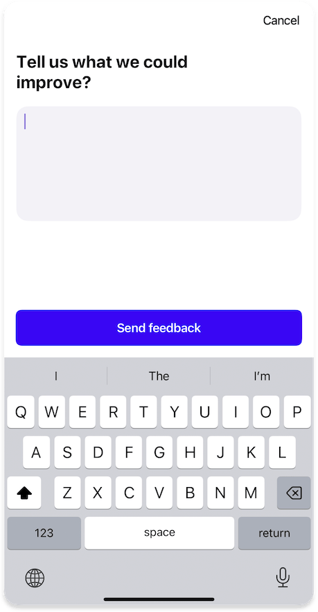
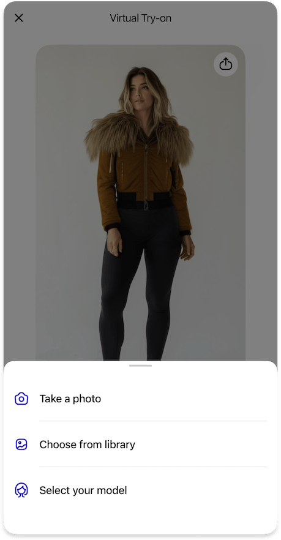

# Results Screen

{width=300}

The Results Screen displays the generated virtual try-on results and provides various interaction options for users to engage with the results, such as:

- Allow users to interact with the results
- Collect user feedback on the try-on quality
- Enable users to continue with different photos
- Store the generation history

## Features

=== "Cart"

    ### Cart Integration

    {width=300}

    Allows users to add products from the try-on results directly to their shopping cart.

    #### Handling
    
    - You need to handle the `addToCart` action that the SDK will trigger when a user wants to add a product to their cart; SDK will close right after that, allowing you to present your own UI for product customization, such as size selection or other options needed for cart addition
    - The SDK will provide the product ID of the item the user wants to add

    ??? tip "Customization"

        #### Customization

        ##### [Text Elements](../resources/localization.md)
        - `addToCart` - Label for the "Add to Cart" button

=== "Wishlist"

    ### Wishlist Integration

    Allows users to add products from the try-on results to their wishlist for later consideration.

    !!! info "Integration benefits"
        - Seamless integration with your existing wishlist functionality
        - Consistent user experience across your app
        - Real-time wishlist status updates

    #### Data Management

    You need to implement a data provider that:

    - Provides the `wishlistProductIds` list of product IDs currently in the wishlist
    - Handles the `setProductInWishlist` callback to add or remove products from the wishlist

    !!! note "Data privacy"
        You don't need to provide the user's complete wishlist. You can filter to include only products related to the current try-on session, or provide the full wishlist - it's up to you. The SDK only uses this data to correctly display the wishlist status for products and doesn't collect or use this information for any other purpose.
    ??? tip "Customization"

        #### Customization

        ##### [Text Elements](../resources/localization.md)
        - `wishlistButtonAdd` - Label for the "Add to Wishlist" button

        ##### [Icons](../resources/icons.md)
        - `wishlist24` - Icon for the wishlist button in normal state
        - `wishlistFill24` - Icon for the wishlist button when product is in wishlist

=== "Feedback"

    === "Survey with quick feedback options"

        ### Feedback

        {width=300}
        {width=300}

        Enables users to provide feedback on the try-on results quality.

        ??? tip "Customization"

            #### Customization

            ##### [Text Elements](../resources/localization.md)
            - `feedbackTitle` - Title displayed in the feedback section
            - `feedbackOptions` - List of feedback options available to users
            - `feedbackButtonSkip` - Label for the "Skip" button
            - `feedbackButtonSend` - Label for the "Send" button
            - `feedbackGratitudeText` - Text displayed after feedback is sent

            ##### [Icons](../resources/icons.md)
            - `like36` - Icon for the "Like" feedback option
            - `dislike36` - Icon for the "Dislike" feedback option
            - `gratitude40` - Icon displayed after feedback is sent

            ##### [Shapes](../resources/shapes.md)
            - `feedbackButton` - Shape for feedback buttons

    
    === "Other (custom user comment)"

        ### Other Feedback

        {width=300}
        {width=300}

        Enables users to provide custom comment on the try-on results quality.

        ??? tip "Customization"

            #### Customization

            ##### [Text Elements](../resources/localization.md)
            - `feedbackOptionOther` - Label for the "Other" feedback option in the survey
            - `otherFeedbackTitle` - Title for the "Other" feedback
            - `otherFeedbackButtonSend` - Label for the "Send" button
            - `otherFeedbackButtonCancel` - Label for the "Cancel" button             

=== "Continue"

    ### Continue with Other Photo

    {width=300}

    Allows users to start a new try-on with a different photo.

    ??? tip "Customization"

        #### Customization

        ##### [Icons](../resources/icons.md)
        - `changePhoto24` - Icon for the "Change Photo" action

=== "History"

    ### Generation History

    Provides access to previously generated try-on results.

    ??? tip "Customization"

        #### Customization

        ##### [Text Elements](../resources/localization.md)
        - `generationsHistoryPageTitle` - Title displayed on the generations history page

        ##### [Icons](../resources/icons.md)
        - `history24` - Icon for the History button in the page bar

    #### Data Management

    === "Built-in"

        By default, the SDK uses platforms' local storage to store the history. This is the simplest approach and requires no additional configuration.

        !!! warning "Anonymous data"

            Neither the SDK nor the Aiuta API have any information about your users; all generated images are completely anonymous and are not linked to any user. Data in the history is stored locally on the device and may be lost when the app is reinstalled.

            If you need to link images to a user profile, use Data Provider instead.

    === "Data Provider"

        You can implement your own custom data provider that:

        - Provides the `generated` list of images previously generated for the user
        - React to the `add(generated:for:)` callback to store new generated images
        - React to the `delete(generated:)` callback to remove images by the user choice

        !!! info "This allows you to"
            - Integrate with your existing user management system
            - Sync the generations history across devices
            - Implement custom business logic for history management
            - Control how generated images are stored and accessed

=== "Disclaimer"

    ### Fit Disclaimer

    {width=300}

    Displays important information about the virtual try-on fit.

    ??? tip "Customization"

        #### Customization

        ##### [Text Elements](../resources/localization.md)
        - `fitDisclaimerTitle` - Title displayed in the fit disclaimer
        - `fitDisclaimerDescription` - Description text in the fit disclaimer
        - `fitDisclaimerCloseButton` - Label for the close button

        ##### [Typography](../resources/typography.md)
        - `disclaimer` - Text style for the disclaimer

        ##### [Icons](../resources/icons.md)
        - `info20` - Icon displayed in the fit disclaimer

---

## [Analytics](../analytics/analytics.md)

The following analytics events may be tracked during results interaction:

| Type | Event | Page Id | Description |
|------|-------|---------|-------------|
| [`page`](../analytics/analytics.md#event-categories) | :material-minus: | [`results`](../analytics/analytics.md#page-identifiers) | Results screen opened |
| [`results`](../analytics/analytics.md#event-categories) | [`resultShared`](../analytics/analytics.md#results-events) | [`results`](../analytics/analytics.md#page-identifiers) | Try-on result was shared |
| [`results`](../analytics/analytics.md#event-categories) | [`productAddToWishlist`](../analytics/analytics.md#results-events) | [`results`](../analytics/analytics.md#page-identifiers) | Product was added to wishlist |
| [`results`](../analytics/analytics.md#event-categories) | [`productAddToCart`](../analytics/analytics.md#results-events) | [`results`](../analytics/analytics.md#page-identifiers) | Product was added to cart |
| [`results`](../analytics/analytics.md#event-categories) | [`pickOtherPhoto`](../analytics/analytics.md#results-events) | [`results`](../analytics/analytics.md#page-identifiers) | User requested to try with different photo |
| [`feedback`](../analytics/analytics.md#event-categories) | [`positive`](../analytics/analytics.md#feedback-events) | [`results`](../analytics/analytics.md#page-identifiers) | User provided positive feedback |
| [`feedback`](../analytics/analytics.md#event-categories) | [`negative`](../analytics/analytics.md#feedback-events) | [`results`](../analytics/analytics.md#page-identifiers) | User provided negative feedback |
| [`exit`](../analytics/analytics.md#event-categories) | :material-minus: | [`results`](../analytics/analytics.md#page-identifiers) | SDK was closed on the results screen |

---

## How to implement

- :fontawesome-brands-android: __Android__
- :fontawesome-brands-apple: __iOS__
- :fontawesome-brands-flutter: __Flutter__

