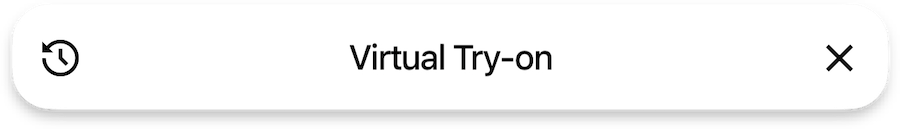
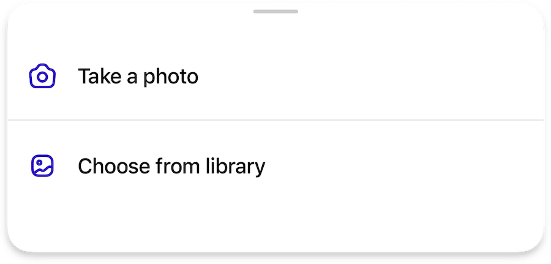

# Other styles, toggles and settings

This page contains descriptions of additional unclassified settings for various user interface components that provide more configuration flexibility.

## Page Bar

A toggle to specify whether the close button should be positioned on the right side.

=== "Default"

    { width=450 }

=== "`preferCloseButtonOnTheRight`"

    { width=450 }    

## Bottom Sheet

Adjusting delimiters in the bottom sheet icon buttons

=== "Default"

    { width=450 }

=== "`extendDelimitersToTheRight`"

    { width=450 }

=== "`extendDelimitersToTheLeftAndRight`"

    { width=450 }

## Component Style

Adjusting colors on some buttons and status views, where explicitly available

!!! info ""
    Shapes are independent and are not affected by this styles

=== "`brand`"

    { width=172 }

    - `brand` background color
    - `onDark` foreground color for labels and icons

=== "`contrast`"

    { width=200 }

    - `onLight` background color
    - `onDark` foreground color for labels and icons

=== "`contrastInverted`"

    { width=200 }

    - `onDark` background color
    - `onLight` foreground color for labels and icons

=== "`blurred`"

    { width=164 }

    - apply a blurred background that matches the color `scheme` (`light` or `dark`)
    - `primary` foreground color for labels and icons

=== "`blurredWithOutline`"

    { width=164 }

    - apply a blurred background that matches the color `scheme` (`light` or `dark`)
    - `primary` foreground color for labels and icons
    - `outline` color for the border

!!! note ""
    Refer to the [:octicons-arrow-right-24: colors :material-invert-colors:](colors.md)

<!-- ## Various pages    

- Optinal `reduceShadows` toggle to reduce shadows on the page where it is possible

- Special tool button / status style of:

    - Deafult `blurred` for a blur effect view with `primary` text color
    - Custom `blurredWithOutline` to add outline/border for a blur view
    - Custom `primary` for opaque view with `onDark` text color -->

